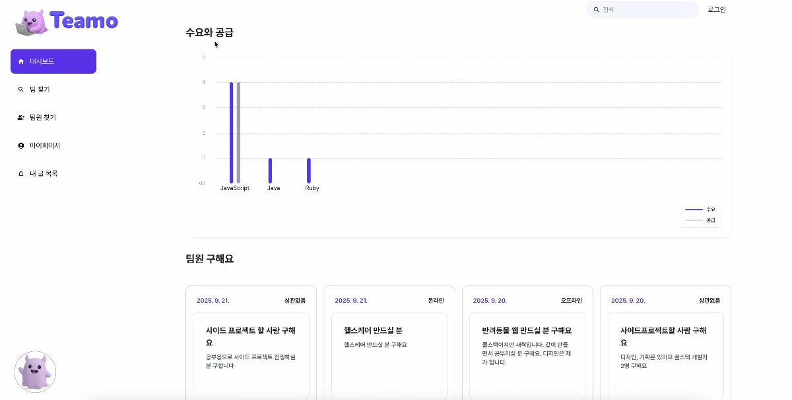
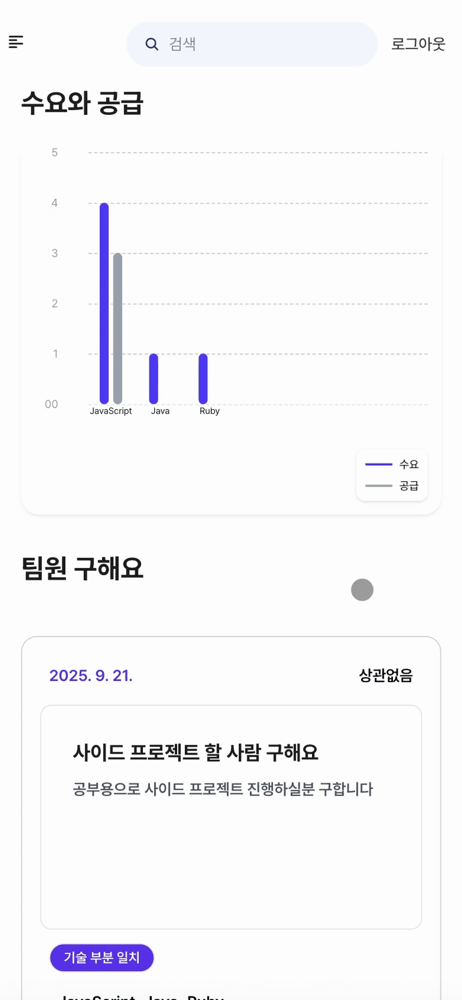
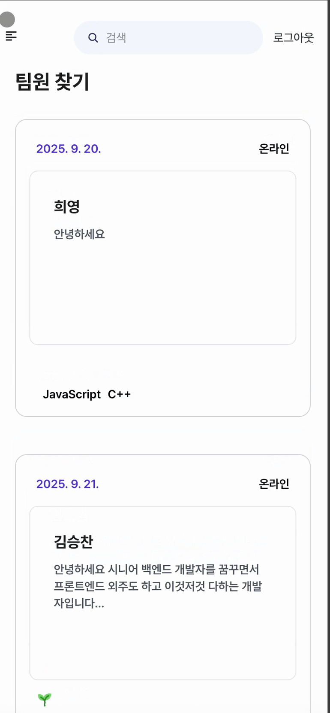
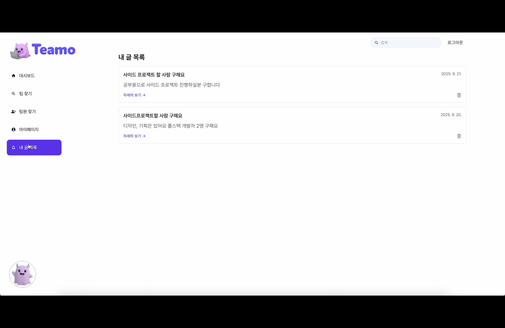
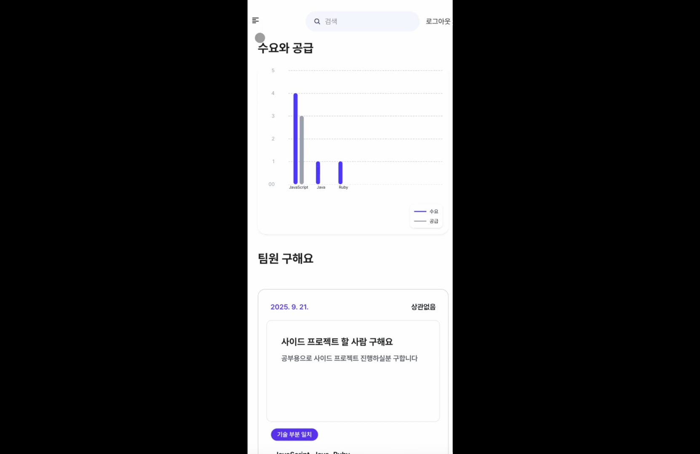
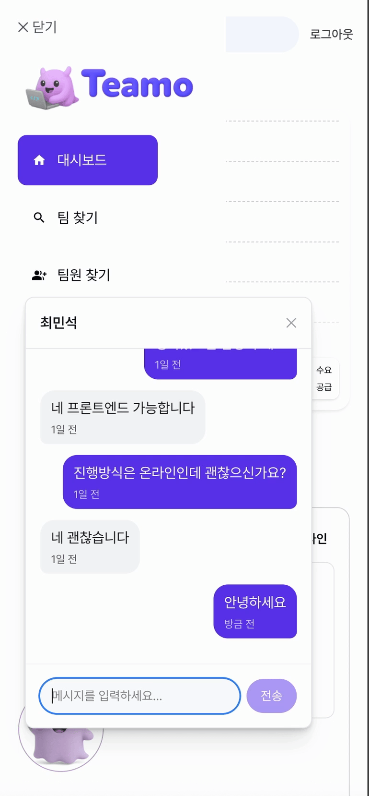

# 🌏 Teamo Frontend

팀원 모집 플랫폼 **Teamo**의 프론트엔드 레포지토리입니다.  
이 프로젝트는 **Next.js + PWA** 기반으로 개발되었으며, NestJs 기반 API 서버와 통신합니다.

> 🧩 이 레포지토리는 **프론트엔드 소스코드뿐 아니라 개발 서버 인프라 설정**도 함께 포함되어 있어, 실제 서비스 환경에서 사용하는 구조를 참고할 수 있습니다.

---

## 📷 주요 화면

| 기능        | 웹                                                         | 앱                                                         |
| ----------- | ---------------------------------------------------------- | ---------------------------------------------------------- |
| 대시보드    |  |  |
| 마이페이지  |   |   |
| 포스트 작성 |    |         |
| 마이포스트 |    |         |
| 검색        |                |            |
| 채팅        |                  |             |

---

## 🔧 주요 기술 스택

- **Next.js** – React 기반 SSR/CSR 프레임워크
- **PWA** – `next-pwa` 적용
- **TypeScript** – 타입 안정성 확보
- **Tailwind CSS** – 유틸리티 기반 스타일링

---

## 🌐 개발 서버 정보

- **프론트엔드 서버**: 미정
  실제 배포된 개발 서버에서 UI 및 API 연동 결과를 확인할 수 있습니다.

---

## ⚙️ 로컬 실행 방법

이 프로젝트는 로컬에서도 쉽게 실행하여 확인할 수 있도록 구성되어 있습니다.

### 1. 레포지토리 클론

```bash
git clone https://github.com/4H-Teamo/Teamo_FrontEnd.git
cd Teamo_FrontEnd
```

### 2. 의존성 설치

```bash
npm install
# 또는
yarn install
```

### 3. 환경 변수 설정

`.env.local` 파일을 생성하고, 필요한 환경 변수를 설정합니다. 예시:

```plaintext
NEXT_PUBLIC_API_BASE_URL=http://localhost:8000        # FastAPI 중개 서버
NEXT_PUBLIC_INTERFACE_URL=http://localhost:8080       # Spring Boot API 서버
```

> `.env.local` 파일은 `.gitignore`에 포함되어 있어, 개인 환경 변수 설정이 가능합니다.

### 4. 개발 서버 실행

```bash
npm run dev
# 또는
yarn dev
```

### 5. 브라우저에서 확인

브라우저에서 `http://localhost:3000`에 접속하여 실행 결과를 확인할 수 있습니다.
